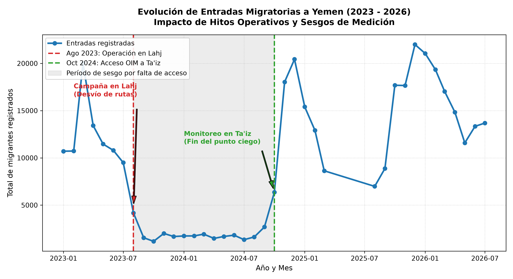

## Yemen Migration

In my first time into data analysis, I downloaded and cleaned some HDX databases of Yemen migrants that arrive either to stay or to leave again. I generate in a unique output some statistics about the migrants profile based on their gender or their age, their route and means of transport. Finally I generated a plot to see how is the fluctuation of people in a time line.

### Yemen migration flux

As we can see in the photo, the main route for migrants was entering through Lahj, but in August 2024 there was a military operation by the Yemen's Government to fight the human trafficking networks. So the route through Lahj was closed and the migration numbers went down to 0. Then, in grey colour we can see a low interval, which is due to no one was monitoring the new main arrival city, Taiz. Since November 2024, the numbers go up again as the monitoring was set up again.

---
### Data Extraction

**Migrants split by gender**

Total registered enters: 379,112 \
• **Men**: 246,522 (65.0%) \
• **Women**: 68,095 (18.0%) \
• **Minors from the total**: 64,495 (17.0%)

**Most frequent routes**

| Departure | Destination | Number of people |
|-- |-- | --|
| Djibouti            |Saudi Arabia |               251573|
| Somalia             |Saudi Arabia  |              101412|
| Djibouti            |Yemen         |               18358|
| Oman                |Yemen         |                6460|
| Djibouti            |Oman          |                 999|

**Most frequent destinations for minors**

Saudi Arabia    58206 \
Yemen            6015 \
Oman              274
